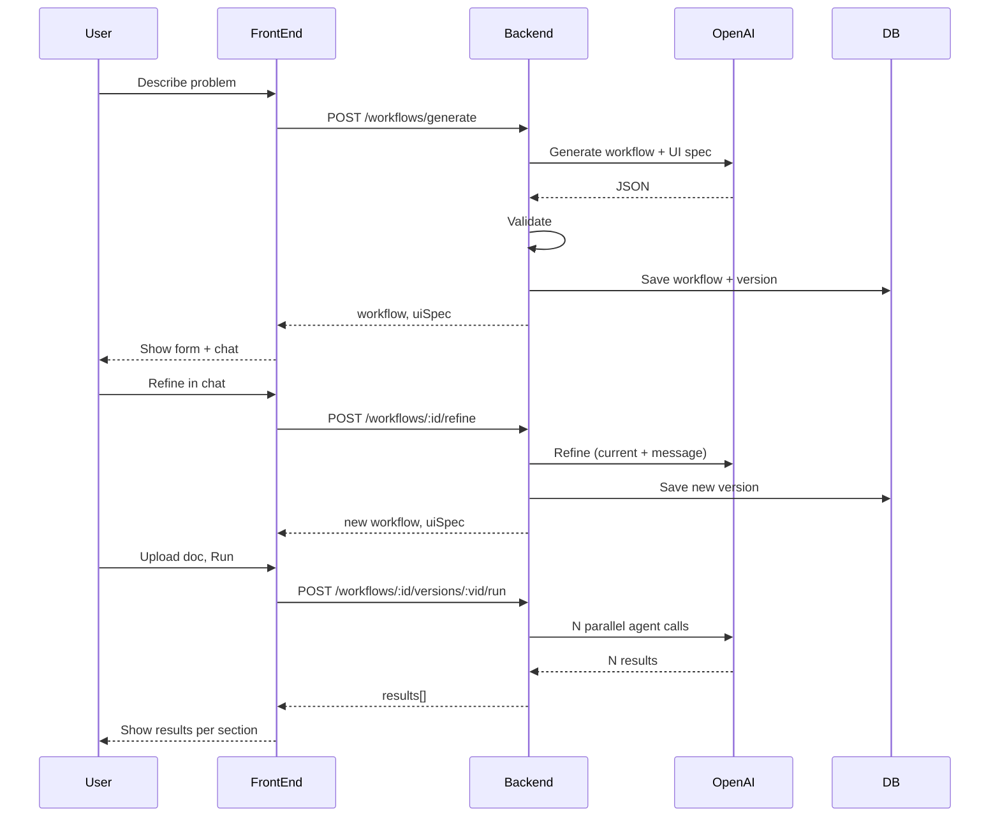

# Technical Specification: Chat-Driven Agentic Workflows

> Traceability: Story 1 (schema), Story 2 (generate), Story 3 (refine), Story 4 (run), Story 5 (interpreter), Story 6 (persistence).

## Architecture Overview

- **Front-end:** Single-page app (e.g. React + TypeScript). Layout: side panel (chat) + main area (workflow summary, dynamic form, results). Communicates with backend via REST (or tRPC) for generate, refine, run, and CRUD.
- **Backend:** API server (Node or similar) with endpoints for workflow generation, refinement, execution, and persistence. Uses OpenAI API (o4-mini) for generation and for each agent during run. Uses Supabase (or Neon) for Postgres and auth.
- **Execution model:** One input (e.g. document text) is sent to N agents in parallel; each agent has a system prompt and receives the same context; results are aggregated and returned.



## Workflow Schema (v1)

- **Input:** Single document (e.g. `type: "document"`). Content passed to all agents (e.g. extracted text).
- **Agents:** Array of `{ id: string, name: string, systemPrompt: string, outputLabel: string }`. `outputLabel` is used to map results to UI spec result sections.
- **No branching:** Linear flow: one input → N agents (parallel) → N outputs. No conditional edges or DAG in v1.

Example (conceptual):

```json
{
  "input": { "type": "document" },
  "agents": [
    { "id": "agent-1", "name": "Executive Summary", "systemPrompt": "...", "outputLabel": "Executive Summary" },
    { "id": "agent-2", "name": "Technical Brief", "systemPrompt": "...", "outputLabel": "Technical Brief" }
  ]
}
```

Validation must enforce required fields and types; reject unknown fields or invalid structure so the interpreter never sees malformed data.

## UI Spec Schema (v1)

- **Form:** List of fields: `{ id, type, label, required?, options? }`. Types: e.g. `file`, `text`, `select`. Used by the dynamic form renderer (Story 5).
- **Results:** List of sections: `{ id, label, agentIdOrOutputLabel }` to map run results to display sections.
- **No arbitrary code or HTML:** Only declarative field and section definitions. The interpreter renders with a fixed set of components (file input, text input, select, result block).

Validation must reject any spec that references unknown types or contains executable content.

## Technology Recommendations

- **Runtime:** Node.js backend; React (or similar) front-end. TypeScript for both.
- **OpenAI:** Official SDK; use o4-mini for both generation/refinement and agent execution. Ensure response format (JSON) and retries/timeouts are configured.
- **Database:** Supabase (Postgres + Auth + optional Realtime). Alternative: Neon + separate auth solution.
- **Validation:** Use a JSON Schema validator (e.g. Ajv) or Zod for workflow and UI spec so invalid AI output is caught before persistence or render.

## Security and Safety

- **No eval of AI output:** Only workflow and UI spec JSON are stored and interpreted. The interpreter does not execute or render raw HTML/code from the model.
- **Auth:** All workflow and version endpoints must be scoped to the authenticated user (e.g. Supabase RLS or application-level checks).
- **File upload:** Limit file size and type; extract text server-side and do not persist raw files in public storage unless required; pass extracted text to agents only.

## Dependencies

- OpenAI API key (env).
- Supabase (or Neon) URL and key; Supabase Auth if using Supabase.
- Backend and front-end share the same schema definitions (e.g. shared package or copied types) so validation and types stay in sync.
