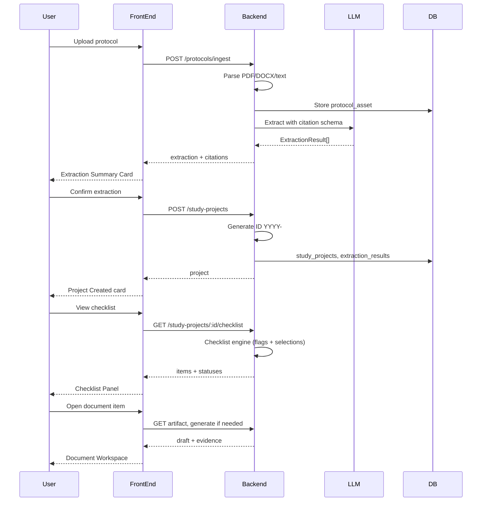

# Technical Specification: Study Project V2

> Traceability: Story 1 (protocol, extraction), Story 2 (entities, ID), Story 3 (checklist), Story 4 (document workspace), Story 5 (intake workspace), Story 6 (chat, audit).

## Architecture Overview

- **Front-end:** Pivot existing React SPA (Agent Config). Layout: Chat Thread (orchestrator) + Output Surface (Extraction Summary, Project Created, Checklist Panel, workspaces) + Artifact Viewer. Reuse chat panel, design system, and accessibility patterns. New: protocol upload, Extraction Summary Card, Checklist Panel, Document Workspace, Intake Workspace, protocol/document viewer with citation jump-to.
- **Backend:** Replace or extend current Node/Express (or equivalent) APIs. New services: protocol ingest (upload/parse PDF, DOCX, text), extraction (LLM with structured output and citations), study project creation (ID generation, persist entities), checklist engine, artifact generation, intake field map and submit. Persist to Postgres (Supabase or Neon); audit_log for audit-lite.
- **Reuse:** Chat as primary UX; agent plan–act–report; design tokens and UI components; auth and user scoping.

## Protocol Ingest and Parsing

- **Inputs:** Multipart file upload (PDF, DOCX) or JSON body with pasted text.
- **PDF:** Use library (e.g. pdf-parse) to extract text; optionally store page boundaries (start char offset per page) for citation jump-to. Store original blob or URL for preview/download.
- **DOCX:** Use library (e.g. mammoth) to extract text; optionally paragraph or run boundaries for citations. Store original for download if needed.
- **Text:** Store as-is; character offsets used directly for citations.
- **Output:** protocol_asset record with normalized text, content_type, optional page_boundaries or segment metadata. Return asset id and text to extraction.

## Extraction and Citation Contract

- See [extraction-and-citations-spec.md](./extraction-and-citations-spec.md). LLM returns structured ExtractionResult per field: value, confidence (low | medium | high), citations array (snippet, startOffset?, endOffset?, page?). Validate with schema; reject or retry on invalid output.
- Store extraction_results linked to protocol_asset and (after confirm) to study_project. Provenance (extracted | inferred | user-provided) on every value.

## Checklist Engine

- **Input:** project (flags: interventional, cancer_related), user selections (which parent items selected to reveal sub-items), persisted checklist_item statuses.
- **Rule structure:** Declarative list of items with (id, label, type: document | intake, parentId?, condition?). Condition is expression on project flags and/or parent selection (e.g. "interventional && cancer_related", "parent_X_selected"). Engine evaluates conditions and returns visible items; sub-items only included when parent selected and (if any) parent condition met.
- **State machine:** Not started → In progress (on Start) → Needs review (when generation completes) → Ready to submit (when user approves; only if submission applies) → Complete (when submit succeeds). Blocked when required data missing (e.g. intake required fields).
- **Persistence:** checklist_items table: project_id, item_id (from rule), status, artifact_id?, intake_payload_id?, updated_at. Engine reads/writes status; API updates status on Start, Regenerate, Approve, Submit.

## Document Generation (Artifacts)

- **Trigger:** User starts a document checklist item or opens "View draft". If no artifact yet, call artifact generation API with project_id, item type, protocol/extraction context.
- **Generation:** LLM (or template) produces draft content (e.g. markdown/HTML). Store in artifacts table: project_id, checklist_item_id, type, content, version. On Regenerate with reason, insert new version, retain previous.
- **Evidence:** Map section or paragraph to citations from extraction or generation step; display in Evidence tab and link to protocol viewer.

## Intake Workspace

- **Field map:** Required fields per intake type (Epic Build, Lab Processing, Radiology, Pharmacy) defined in schema or config. Proposed values from extraction (where field names align) or prior save; source = citation or "user-provided"; confidence from extraction or N/A. Validation state: OK, Missing, Needs attention.
- **Agent questions:** When required field is missing or conflicting, agent (or backend) adds question to exceptions; user answer updates proposed value and marks source as user-provided.
- **Submit:** Validate no required Missing; require confirmation checkbox; persist intake payload (or placeholder), update checklist item to Complete, log in audit_log.

## Technology Stack (Alignment with Current App)

- **Client:** React, TypeScript, Vite; existing design system (Tailwind, tokens, shadcn/Radix). New: protocol upload component, Extraction Summary Card, Checklist Panel, workspace views, protocol/document viewer.
- **Server:** Node/TypeScript; existing patterns. New: protocol parsing (pdf-parse, mammoth or similar), extraction service (OpenAI or same LLM as current), study project and checklist APIs, artifact generation, intake APIs.
- **DB:** Supabase (Postgres + Auth) or existing Neon/Postgres. New tables: study_projects, protocol_assets, extraction_results, checklist_items, artifacts, intake_payloads (or equivalent), audit_log.
- **Validation:** JSON Schema or Zod for extraction result, citation, and checklist rule structures. Validate all LLM output before persistence.

## Security and Safety

- **Auth:** All study project and checklist endpoints scoped to authenticated user (RLS or app-level).
- **No eval of AI output:** Only structured extraction and artifact content stored; no execution of generated code. Document preview renders sanitized HTML or PDF.
- **Provenance:** Never overwrite without recording; audit_log for key actions.
